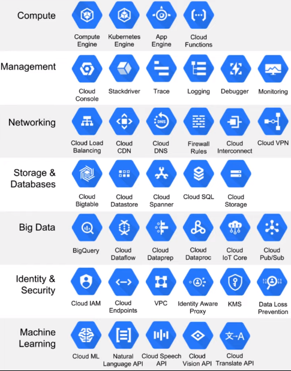

# 1.1.1 - Introduction to Google Cloud Platform

## What is it?
- Cloud computing services offered by Google
- Range of hosted services for compute, storage and app development on Google hardware
- Same hardware on which Google runs its services

## Use

Go to the [web console](https://console.cloud.google.com/home/dashboard) and dashboard
- GCP works in terms of **projects** - choose this to the left of the search bar
- Navigate through:
    - Navigation bar on left side of page
        - E.g. Storage > Cloud Storage
            - In cloud storage you can see buckets.
                - E.g. nyc-tl-data bucket with all the data from the NYC TLC website
            - Set up similar to AWS
    - Can navigate via search bar
        - Use this to navigate to `BigQuery`
        - E.g. Can access data from above bucket in editor

We will set up these data later