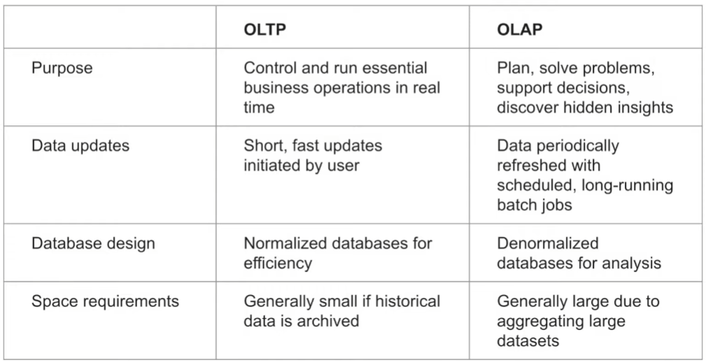
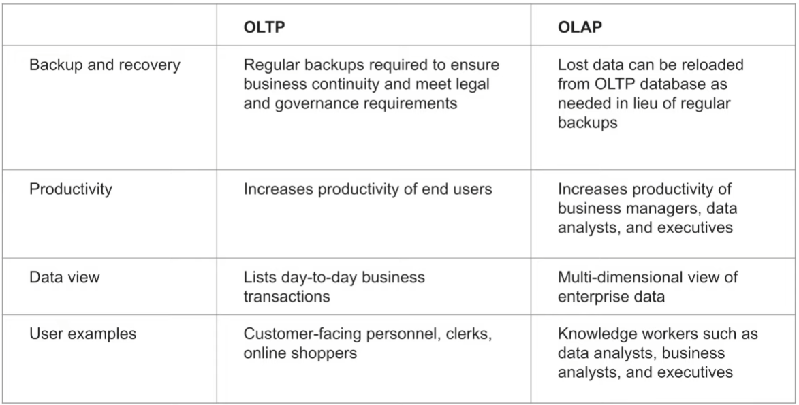
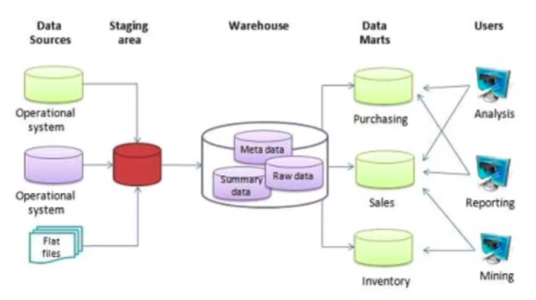
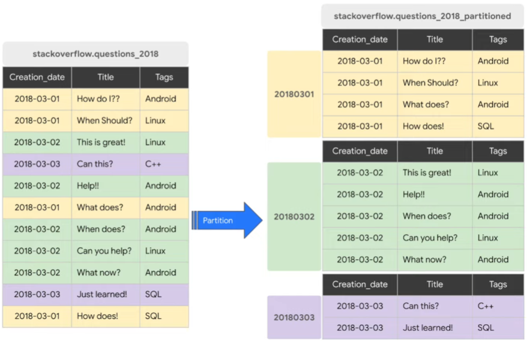
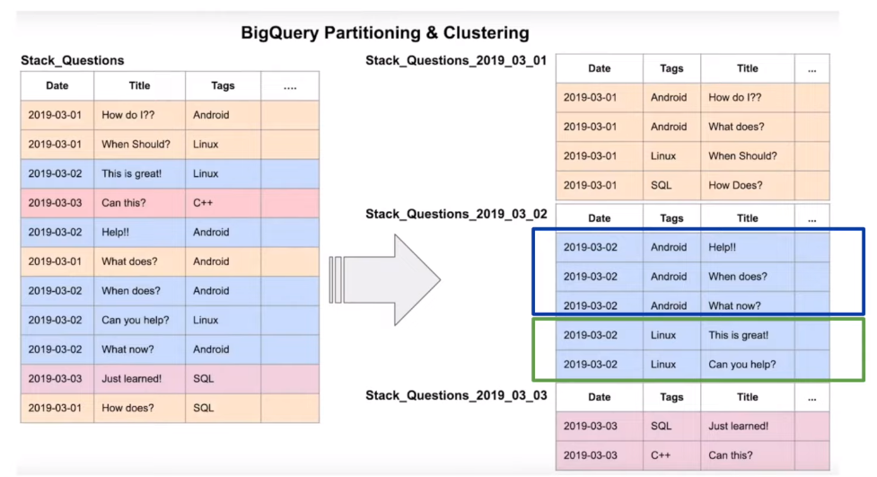

# 3.1.1 - Data Warehouse and BigQuery

## Index
- OLAP vs OLTP
- What is a data warehouse?
- BigQuery
    - Cost
    - Partitions and Clustering
    - Best practices
    - Internals
    - ML in BQ

## OLAP vs OLTP
OnLine Transaction Processing vs OnLine Analytical Processing

- OLTP usually done in the backend
    - Grouping a couple of SQL queries together and rolling back on failure
- OLAP more for putting a lot of data in and finding insights
    - Used by data scientists and data analysts

- OLTP usually for end user data
- OLAP usually for high level company decisions

## Data Warehouses
- OLAP solution
- Used for reporting and data analysis

Warehouse usually consists of metadata, summary data, and raw data
- Data may come from OS, OLTP system, dataset
- Can be transformed into Data Marts as interface for data scientists
- Data scientsts may want to see directly from data warehouse
- Just know there are multiple interfaces

## BigQuery
- Serverless data warehouse
    - No servers to manage or database software to install
    - Usually companies have high upfront cost and time before they can use system
- Software as well infrastructure including
    - **Scaling** and **high-availability**
    - Can start from few GB and easily scale to PB
- Bult-in features including:
    - Ml
    - Geospatial analysis
    - Business Intelligence
- BiqQuery maximizes flexibility by separating the compute engine that analyzes your data from your storage
    - Large win in terms of cost

Go to GUI in browser: https://console.cloud.google.com/bigquery
- Clean SQL notepad interface
- Data sources on the right

BigQuery normally caches data
- Disable from Query > More > Query Settings

Can easily search any dataset with table name in search bar in the Data Explorer
- Looking at the table, shows schema on the first tab
- Details tab show metadata like number of rows and data size
- Preview tab shows the first 100 rows

Go back to the Query Tool
- Running a query shows the results on the bottom
    - Can save results to CSV
    - Can *explore* data using Data Studio

## BiqQuery Cost
- On-demand pricing - by amount of data
    - 1 TB of data processed is $5
- Flat price pricing - above 400 TB of data 
    - Based on number of pre-requested slots
    - 100 slots -> $2000/month = 400 TB data processed on-demand pricing
- Queries can also compete with each other
    - E.g. If you have 50 queries running, and all 100 slots are full
        - Then 51st query HAS to wait
    - The on-demand model would just give you another slot

## Back to BigQuery
Allows you to create databases from external sources
- Using CSVs from GCS bucket can make a CSV
- Previewing the new table from the data sources explorer shows schema
    - Shows BiqQuery has found names, inferred typing and knows if the field is nullable or not
        - Very useful as it is automatic
    - Looking at Details shows table size and long-term storage size is 0 B
        - When making an external table, BigQuery cannot determine size or costs as data is not in BigQuery itself
- Can also import schema if you wish

At this point the video refers to [biq_query.sql](../big_query.sql)
- You will have to edit to point to your own GCS bucket, and edit file format to parquet
    - Have to upload all of 2019 and 2020 yellow trip data

Querying the new table shows the results at the bottom
- Can see every field

## Partition in BQ

Generally we have creation_date, title and tags fields
- Assuming that most of our queries are upon date, and use it as a filter
    - E.g. get all the questions or count of questions only from first week of March
    - Then paritioning will really improve BigQuery performance
- Left table is raw data, on the right are the tables when partitioned by day
    - E.g. March 1st 2018, then March 2nd 2018, and then March 3rd 2018
- Skipping so many rows will save on cost as we are processing less data

Converting our dataset in BigQuery Query Tool
- Go to `--Create a non partitioned table from external table`
    - Edit and run the two lines
    - May take some time as it is creating tables
- Go to `-- Create a partitioned table from external table`
    - Now it uses `PARTITION BY` on the DATE tpep_pickup_datetime
    - Run these 4 lines after the last command was done
    - Creates table 'yellow_tripdate_partitioned
    - Table size is almost 14 GB
        - This is HUGE, so delete it after if need be.
- Notice that the partitioned tables and non-partitioned tables have different icons
    - The former has a break in the icon

Checking the impact of the partition - go to `Impact of partition`
- When you highlight these 3 lines, in the top right it previews shows how much data is processed after a few seconds
- Going to the next query, `-- Scanning ~106 MB of DATA`, and highlight
    - It should be 106 MB which is very useful in the long-term

Go to `-- Let's look into the partitons`
- It shows partitions the number of rows by the partition_id (the day) going from highest to lowest
- Can show if there is bias in partitions - imbalance in the number of rows in partitions

## Clustering in BigQuery

Back to the StackOverflow example, we had 3 columns - date, title and tags
- Now we will **cluster** by tag.
    - In partition 2, dates then tags are sorted (alphabetical)
- Improves cost and query performance

Go back to BigQuery UI: https://console.cloud.google.com/bigquery
- Go to `-- Creating a partition and cluster table`
- Creates a new table that is partitioned the same way but clusted by VENDORID
    - What matters is the use case though; luckily we are querying by Vendor ID and Pickup Date.
- Go to the new clustered table, notice the fields are the same
    - In the details tab we can see the fields it is partitioned and clustered on

Comparing the partitioned and the partitioned and clustered tables
- Go to `-- Query scans 1.1 GB` and see two commands, both running the same commands on the different tables
    - Can see they scan 1.1 GB vs 864.5 MB (even if BiqQuery estimates 1.1GB)
    - The first query takes 0.7 seconds, the second takes 0.8 seconds
        - On larger datasets the times will be shorter
