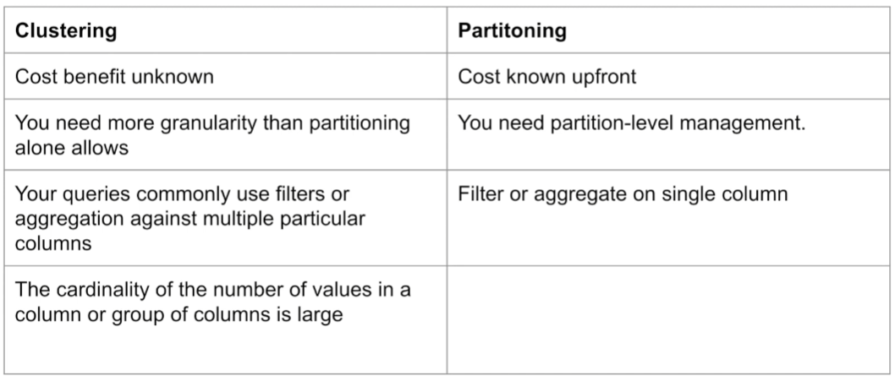

#  3.1.2 - Partioning and Clustering

BigQuery Partitioning
- Can choose between:
    - Time-unit column
        - Can select between daily/hourly/monthly/yearly
            - Defaults to daily
                - Good when data is medium sized and evenly distributed 
            - For hourly, consider the partitions you want to make
                - Will make a lot, consider having a data expiration set
            - For monthly or yearly, you will generally have small amount of data
                - But the data will generally be less even

## Clustering
- Columns you specify are used to colocate related data
    - Order of the column is important
    - The order of the specified columns determines the sort order of the data
    - E.g. Sorted first on column A, then column B, then Column C
- Clustering improves:
    - Filter queries
    - Aggregate queries
    - (Need to be using these)
- For SMALL datasets:
    - If table size < 1 GB, partitioning/clustering does not show improvement
    - Actually adds overhead and cost
- Can specify up to 4 clustering columns

Clustering columns must be top-level, non-repeated columns
- DATE
- BOOL
- GEOGRAPHY
- INT64
- NUMERIC
- BIGNUMERIC
- STRING
- TIMESTAMP
- DATETIME

# Comparing Partitioning and Clustering

- If budget is very important, then partitioning is very important
    - Can limit queries by cost/data with partitioning
- With partitioning you can delete, copy etc partitions - cannot do this with clusters
- Partitioning only possible on one column - vs 4 for clustering
- Cardinality important because there is a limit of 4000 partitions per table

### Clustering over Partitioning
- Partitioning results in small amount of data per partition (approx < 1GB)
- Partitioning results in a large number of partitions beyond the limits of partitioned tables
- Partitioning results in your mutation operations modifying the majority of partitions in the table frequently
    - E.g. Every hour your write or read all partitions, it is a bad idea

## Automatic Reclustering
As data is added to a clustered table
- the newly inserted data can be written to blocks that contain key ranges that overlap with the key ranges in previously written blocks
- These overlapping keys weaken the sort property of the tables

To maintain the performance characteristics of a clustered table
- BQ performs automatic re-clustering in the background to restore the sort property of the table
- For partitioned tables, clustering is maintained for data within the scope of each partition