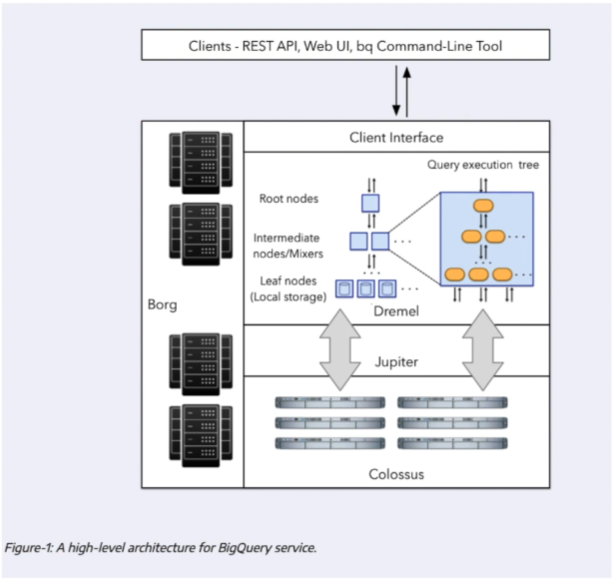
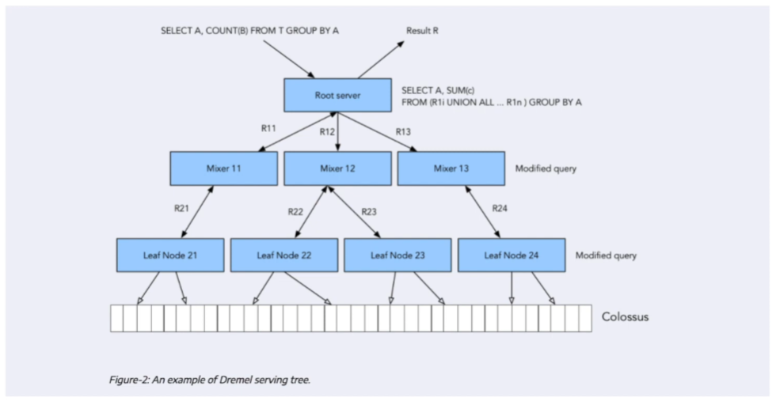

# 3.2.2 - Internals of Big Query

Not necessary to know but can help if you are designing large application

Stored in separate storage called **Colossus**
    - Cheap storage that stores in columnar format
    - Big advantage: because storage and compute are separate, there are significantly less cost
    - If data size increases, you generally just have to pay is storage for Colossus
- Most cost incurred is while running queries itself - compute
    - That is why separation helps
- But, if these are on different hardware, how do they computer with each other?
    - Bad network can result in high latency
    - Uses the **Jupiter network**

**Jupiter** network inside BQ datacenters provides ~1TB/s network speed
- Important as it facilitates separation of compute and storage

**Dremel** is the query execution engine
- Divides query into tree structure and divides it in such a way that each node can perform an individual subset of query

## Columnar vs Record-Oriented

- Row-oriented storage very similar to structures like CSV
- Column-oriented has each row split up and together with whole fields
    - Helps provide better aggregations on columns
    - Generally when using BQ, do not query all columns at one time. Query few columns and query/aggregate different ones

## Dremel Tree

Assume you have the query above
- When the root server receives this query, it parses and finds how to divide this into smaller submodules
    - Can see the divided query next to the root server box
- Query further divided into subsets of queries and given to the leaf nodes
    - These are the part that actually communicate with the Colossus databases, fetches, executes appropriate operations
    - These results are returned to the Mixers, and then the root server
- This parallelism with the leaf nodes is the reason BigQuery is so fast
    - Important to be able to split up queries and assign them accordingly
