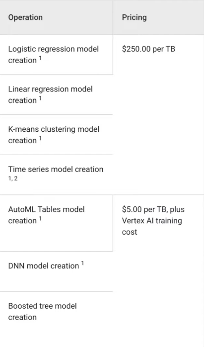
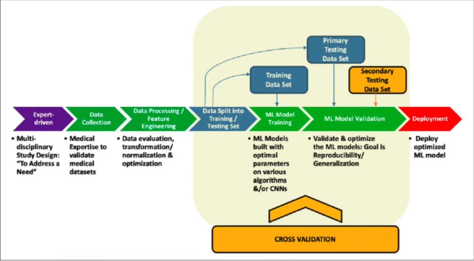
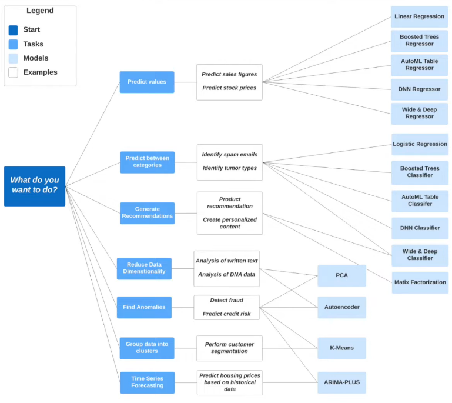

# 3.3.1 - BigQuery Machine Learning

- Target audience Data analysts, managers
- No need for Python or Java knowledge
- No need to export data into a different system

## Pricing

- Free
    - 10 GB per month of data storage
    - 1TB per month of queries processed
    - ML Create model step: First 10 GB per month free
- Non-free
    - 

## Steps

- BQ helps with all these steps
    - Allows feature engineering, automatic too
    - Auto train/test split
    - Choose different algorithms
    - HP-tuning
    - Provides error matrices to do validation against
    - Allows you to deploy with Docker image

- BQ docs provides this table on what algorithm to use for what you want to do

## Building Linear Regression Model

Go back to the editor: https://console.cloud.google.com/bigquery and use [big_query_ml.sql](../big_query_ml.sql)
- Make sure you have added all the tables from [big_query.sql](../big_query.sql)

E.g. We are not an expert in data science; we choose columns we think are important at the start
- We select the fields where fare_amount is not 0, as those also have tip_amount 0

See the docs: https://cloud.google.com/bigquery-ml/docs/reference/standard-sql/bigqueryml-syntax-preprocess-overview
    - Feature preprocessing steps are divided into two parts: automatic and manual
        - For automatic, some steps are standardization, one-hot encoding, and multi-hot encoding
            - Multi-hot is like one-hot but you only use log2(labels) vectors to save on size
            - Runs into the issue of false class relationships and false additive relationships
        - Manual preprocessing such as bucketize, polynomial expansion, feature cross, ngrames, etc
            - Do not need to use any for this example but they recommend trying

Some of these features will not be useful such as PULocationID, DOLocationID, payment_type
- So we create a different table from the table turning these fields into strings
- This allows BQ ML to automatically interpret and one-hot encode these as if they were categorical variables
- Also turn trip_distance, fare_amount, tolls_amount and tip_amount into FLOAT64
- Run the code to make this table

Now we will create the model, named `tip_model` using linear regression to find the tip amount
- Uses autosplitting to split the data for training and evaluation
- Run to create the model
    - May take 5 minutes
- Going to the model details, we can see the model type, temporary training and evaluation datasets
    - No optimizations done, the duration taken, and the evaluation metrics
    - MAE is ~1 and MSE ~8.5; not good, but just an example

Let's look at the features under CHECK FEATURES
- We can seee passenger_count, trip_daistance, fare_amount, tolls_amount have their basic statistics
    - Min, max, mean, stdev, counts
- Can also see PULocationID, DULocationID and payment_type have been one-hot encoded with category counts

Now let's evaluate the model against training data - just needs `ML.EVALUATE()`
- Just needs model name and dataset
- Can see MAE, MSE, etc
    - These can be used to optimize model later on

Now we can use `ML.PREDICT()` to see our tip amount
- Extra column now - the predicted tip amount
- Can also use for manual prediction

Now let's run `ML.EXPLAIN_PREDICT` to tell us the top features for our dataset
- We specify top_k features
- Run this and see our category features are our top 3 features

We know our model is not optimal - we can do some HP tuning
- BQ provides many different features; for Linear Regression we get:
    - Number of trials
    - Max parallel trials
    - L1 regression
    - L2 regression
- There are more parameters: https://cloud.google.com/bigquery-ml/docs/reference/standard-sql/bigqueryml-syntax-create
    - We can see all of the parameters by algorithm in the docs link
    - ML knowledge helps here