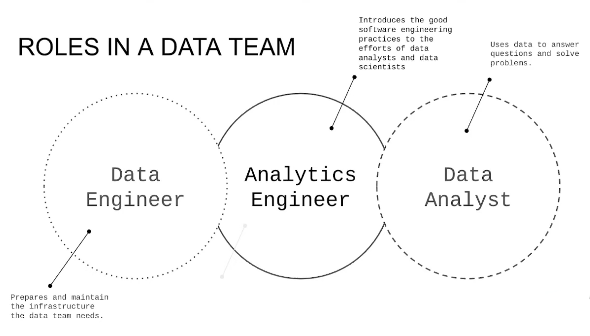
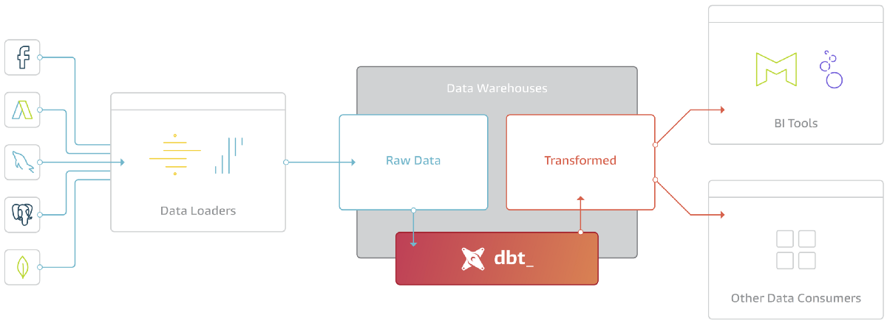

# 4.1.1 - Analytics Engineering Basics

## 1. What is Analytics Engineer?
Need to look at the history of the data domain:
- Seen how cloud data warehouses lowered the cost of storage and computing
- Tools like 5tran and Stitch simplify the ETL process
- SQL-first tools like Looker that introduced VCS for the data workflow
- Other BI tools like Model
- Data Governance
    - Changed the way data teams worked and how stakeholders consumed data

Left gaps in the roles in a data team.
- Traditional data team: data engineer/analytics engineer/ data analyst
    
    - These days data scientists and analysts writing more and more code
        - But they are not meant to be software engineers
        - Not trained for that and not their first priorities
    - Data engineers have the training and do not know how business users will use this
- This is the gap Analytics Engineers are trying to fill

Tools analytics engineer may be exposed to:
1. Data Loading
2. Data Storing (data warehouses like Snowflake/BigQuery/Redshift)
    - May be shared with Data Engineers
3. Data modelling (Tools like DBT or Dataform)
4. Data Presentation (BI Tools like Google Data Studio, Looker, Mode, or Tableau)

## 2. Data Modelling Concepts
Recap: ETL and ELT
- ETLs extract sources, transform it, then load to data warehouse
    - Longer to implement as we have to transform data
    - However, slightly more stable and compliant data (now cleaned)
    - Higher storage and compute costs
- ELTs, tranform data once in the data warehouse
    - Faster and moe flexible and data analysis
    - Cloud means lower cost and lower maintenace to facilitate this

### Kimball's Dimensional Modelling
- Objective:
    - Deliver data understandable to business users
    - Deliver fast query performance
- Approach
    - Prioritize user understandability and query performance over non-redundant data (3NF)
        - 3NF: Third Normal Form
        - Not going to prioritizing the fact that data masks only appear once 
- Other Approaches
    - Bill Inmon
    - Data Vault

### Elements of Dimensional Models
- Also known as Star Schema

Fact Tables
- Measuirements, metrics, or facts
- Corresponds to a business *process*
- "verbs"

Dimensions tables
- Corresponds to a business *entity*
- Provides context to a business process
- "nouns"

### Architecture of Dimensional Modeling
Keychain analogy - data warehouse can be compared to restaurant

Stage Area (Fridge etc)
- Contains the raw data (ingredients)
- Not meant to be exposed to everyone - just people who know how (cooks)

Processing Area (Kitchen)
- From raw data to data models (cooking) - only people who know how to (cooks)
- Focuses in efficiency
- Ensuring standards

Presentation area
- Final presentation of the data
- Exposure to business stakeholder

We are going see in our project how we will do these steps with our data transformation

## 3. What is dbt?

data build tool - transformation tool that allows anyone that knows SQL to deploy analytics code following software engineering best preactices like modularity, portability, CI/CD, and documentation.

- After the extraction and the loading, we will have a lot of raw data in our data warehouse
- Need to transform it before showing stakeholders and performing analysis
- Does not just help transformations, but also introduce good software practices we mentioned
- Defines a development workflow:
    - Develop models
    - Test and document models
    - Deployment phase (VCS and CI/CD)

### How does dbt work?
Modelling layer where we transform data
- Turn table into model
- This data is transformed and persisted  back to the database
- Each model is:
    - A *.sql file
    - Select statement, no DDL or DML
    - A file that dbt will compile and run in our DWH
- Compiles code by creating DDL or DML and pushes to data warehouse
    - Then will be able to see table or view in the warehouse

### How to use dbt?
dbt Core
- Open-source project that allows data transformation
    - Builds and runs a dbt project (.sql and .yml files)
    - Includes SQL compilation logic, macros and DB adapters
        - Will compile your code to the DB you're using
    - Includes CLI interface to run dbt commands locally
    - Free to use

dbt Cloud
- SaaS application to develop and manage dbt projects
    - Web-based IDE to develop, run and test dbt project
    - Jobs orchestration
    - Logging and Alerting
    - Integrated documentation
    - Free for individuals (one developer seat)

### How are we going to use dbt?
BigQuery
- Development using Cloud IDE
    - Deployment and orchestration in GCP
- No local installation of dbt core

Postgres
- Development using a local IDE of your choice
- Local installation of dbt core connecting to the Postgres database
- Running dbt models through CLI

- Data Sources (EL)
    - Trip data we have been using
    - Taxi zone lookup data
- Data Transformation (T)
    - Transform raw data into transformed data via dbt
    - In Postgres or BigQuery
- Analytics Tools
    - Dashboard etc