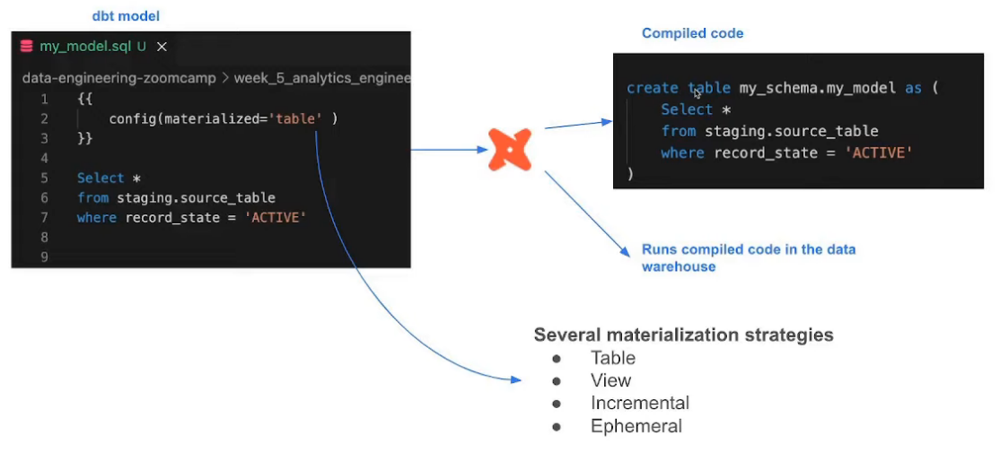
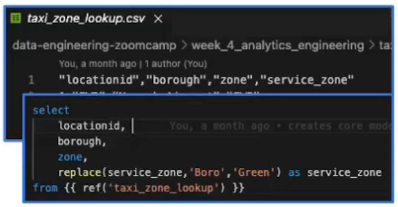
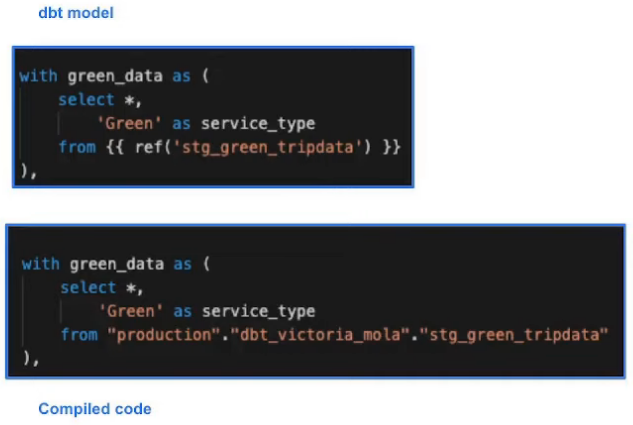
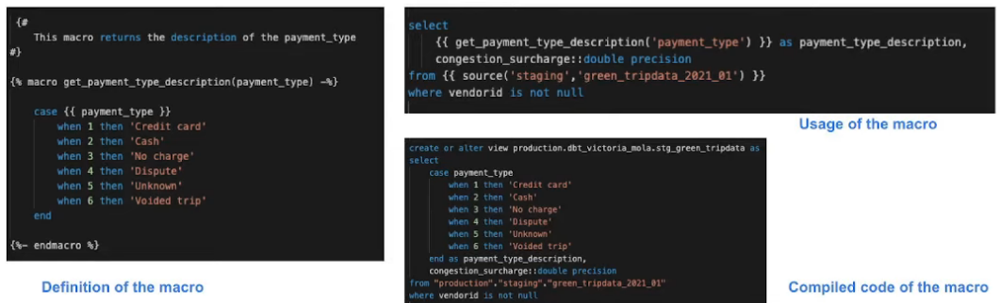
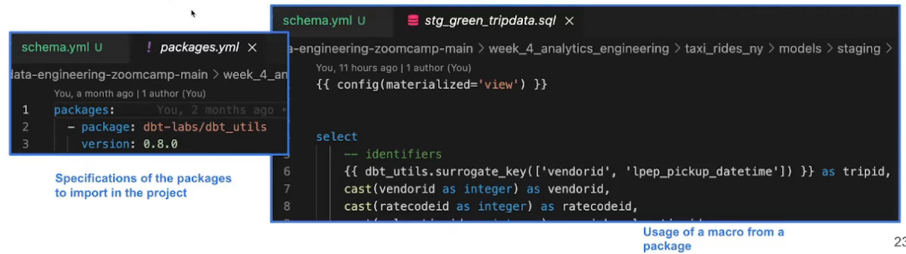
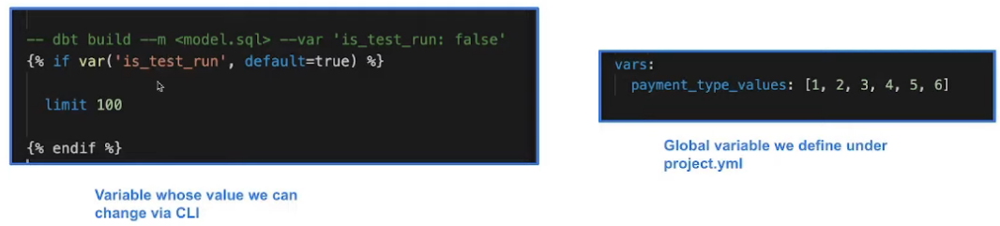

# Build the First dbt Models

## Development of dbt models



dbt code has a lot of curly brackets; the SQL files we are using will also be using Jinja
- Python language that will always be between `{{}}` or ``
- Also has macros to help us generate the full code later

At the beginning of a model, we use `config()` macros used to add DDL or DML to the model
- E.g. `config(materialized='table')` - this is a materialization strategies
    - Can make more strategies if you are an advanced user

Materialization strategies:
- Table
    - Translates schema to make table and replaces if it already exists
- View
    - Like table but with creating or altering a View
- Incremental
    - Essentially like table but let's us run model incrementally
    - Useful for data that does not change often
        - Could run model, transform and insert only the latest data 
- Ephemeral
    - Like a CTE in a another file that we could embed
    - Derived model

### FROM clause
Models are essentially just select statement - what do we use for the FROM clause?
- Know we want to use the **Sources** we loaded from green and yellow trip data:
    - The data loaded to our dwh that we use as sources for our models
    - Configuration defined in the yml files in the models folder
    - Used with the source macro that will resolve the name to the right schema, plus build the dependencies automatically
    - Source freshness can be defined and tested
    - Our example:
        - We use the `source()` macro calling a yaml file where we define the sources
            - Database would be the BQ, and the schema we want to use
            - Can as describe as many tables as we want
        - When we run `source('staging', 'yellow_tripdata_2021_01')` it will pull from the `yellow_tripdata` table from the dataset `production`
        - Run freshness check by error out data more than 6 hours old
- **Seeds** also help load data:
    - CSV files stored in our repo under the seed folder
    - Benefits of version controlling (as it is in a repo) 
    - Equivalent to a COPY command
    - Recommended for data that doesn't change frequently
    - Runs with `dbt seed -s file_name` - can choose everything in the folder or just a file
        - Recommended to set up pipeline for any data that changes frequently
    - Example: 
        - 
- **Ref** macro
    - References the underlying tables and views that were building the data warehouse
    - Run the same code in any environment, it will resolve the correct schema for you
    - Dependencies are built automatically
        - 
        - See that we only call one name, `ref('stg_green_trpdata')`; no schema or database etc
        - Automatically translates to "dbt_[first_initial][last_name]"
        - Would automatically translate to the production or staging version of data
        - Important as it encapsulates the actual logic (exact path) for the proper environment

## Building the model

Go to the editor: https://cloud.getdbt.com/
- Make folders `models/staging` and `models/core`
    - `staging/` will have some raw models (cleanup, renaming, type casting)
    - `core/` will have the models used to exposed to our BI tool or stakeholders
- Create model `stg_green_tripdata.sql` under `staging/`
    - Add `{{ config(materialized='view') }}` as we just want a view so it does need to be updated
    - Want to call from a source rather than the full name so we need to define that
- Make a file `schema.yml` in the same folder
    - Add:
        ```
        - name: staging
          database: dtc-de-377105
          schema: trips_data_all
        ```
    - Under this add:
        ```
        tables:
            - name: green_tripdata
            - name: yellow_tripdata
        ```
    - Could also add `freshness` field to this schema or the tables individually and define a threshold
        - E.g. we receive green tripdata every hour so then define threshold of 3 hours
            - So when we check the source freshness and check the loading field and make sure the latest data is not older than 3 hours
        - Won't do this right now though
- Back to `staging/stg_green_tripdata.sql`
    - Add `select * from {{ source('staging', 'external_green_tripdata')}}`
        - If we wanted to do this for the Postgres DB instead just need to replace `database` in `schema.yml`
    - Add `limit 100` right below
- In the command bar at the bottom:
    - Could do `dbt run -m <model to run>` OR
    - Run `dbt run` to run every model including the examples
        - Do this. It will show us how many models ran, which failed and which were skipped
            - Important as models depend on other models; if a prior model fails it skips the later ones
        - Delete the examples folder
- Edit the `select` to call only the fields that are shared between the yellow and green datasets
    - Add the second select from [stg_green_tripdata.sql](../taxi_rides_ny/models/staging/stg_green_tripdata.sql)
        - Remove the first `tripid` line
        - Remove the line with `payment_type_description` near the bottom
    - Some changes; e.g. `lpep_dropoff_datetime` to `dropoff_datetime` and some typecasting
- To run, can run `dbt run -m stg_green_tripdata` or  `dbt run --select stg_green_tripdata` or `dbt run -f stg_green_tripdata`
    - These are all equivalent.
    - Run the model. Should be fine
- Go to BigQuery, and see the `dbt_[firstinitial][lastname]`
    - Should see the two examples and the staging green tripdata models

## Macros in Jinja
- Use control structures (e.g. if statements and for loops) in SQL
- Use environment variables in your dbt project for production
- Operate on the results of one query to generate another query
- Abstract snippets of SQL into reusable macros - these are analogous to functions in most programming languages
    - Returns code (as opposed to the result in a user-defined function)
    - Defined like a function: `macro <macro_name(arguments)`
- Helpful if we want to use the same transformations for several models
- Defined in the `macros/` folder with a combination of Jinja and SQL
- 
    - First image:
        - `{##}` comment blocks
        - `` defining a macro
            - `` finish defining macro
        - `case {{ <argument> }}` is the argument passed to the macro
    - Second image:
        -  Call macro with `{{ <macro name>('<arguments>') }}`
    - Third image:
        - Replaces macro call with macro code

## Applying the Macro
Under the `macros/` folder make a file `get_payment_type_description.sql`
- Copy the contents of [get_payment_type_description.sql](../taxi_rides_ny/macros/get_payment_type_description.sql)

Call this in `stg_green_tripdata.sql` right before the last cast
- `{{ get_payment_type_description('payment_type') }} as payment_type_description,`

Notice there is a `targets/` folder that is in the `.gitignore`
- This is the compiled code for the generated models under `compiled/`
    - We can find the compiled `stg_green_tripdata.sql` under here
        - See the macro expanded
        - Can see how the source is translated in the FROM clause

## Packages
- Like libraries in other languages
- Standalone dbt projects, with models and macros or tests that tackle a specific problem area
- By adding a package to your project, the package's models and macros will become part of your own project.
- Imported in the `packages.yml` file in project root and imported by running `dbt deps`
- A list of useful packages can be found in [dbt_package_hub](https://hub.getdbt.com/)
- 
    - Left - specifying packages to use
    - Right - calling a package macro by prefixing macro name with package name

Create file `packages.yml` in the project root.
- Add the content from [packages.yml](../taxi_rides_ny/packages.yml)
- Then run `dbt deps` to download and contents of packages.yml
- Should create folder `dbt_packages/dbt_utils/` and see the code itself

Need to run `dbt deps` before running a project if it has any dependencies

Go back to calling macro in `stg_green_tripdata.sql`
- Add `{{ dbt_utils.generate_surrogate_key{['vendorid', 'lpep_pickup_datetime']} }} as tripid,`
- Run this.

Go to the compiled version of the code to see how it is translated
- runs to_hex(md5()) and coalesces the model to make sure there are no spaces
- Makes a unique identifier

## Variables
- Useful to define values that can be used acroos the project
- With a macro, dbt allows us to provide data to models for compilation
- To use a variable we use the `{{ var('...') }}` function
- Variables can be defined in two ways:
    - In the dbt_project.yml file
        - Like a global variable
    - On the command line
        - E.g. `dbt run -m <model.sql> --var 'is_test_run: false'`
- 

Go back to `stg_green_tripdata.sql`
- Remove `limit 100`
- Copy the variable code from the bottom of [stg_green_trip_data.sql](../taxi_rides_ny/models/staging/stg_green_tripdata.sql) and paste into the editor
    - Should allow us to run model with or without the `limit 100`
- Add `where vendorid is not null` right above the variable call
- Run the model.
- In the compiled code, because it defaulted to true, we should just see the result of the function (`limit 100`)

If we run `dbt run -m stg_green_tripdata --var 'is_test_run: false'` instead, the compilation will change.
- Deleting the compiled file and running this should show that `limit 100` is now gone

## Yellow Tripdata
Create the file `model/stg_yellow_tripdata.sql`
- Copy from [stg_yellow_tripdata.sql](../taxi_rides_ny/models/staging/stg_yellow_tripdata.sql)
    - Almost like the green trip data file with small changes:
        - `tpep*` instead of `lpep`
        - Some fields defined as defaults
        - Calls the 'yellow_tripdata' source
- Run `dbt run --var 'is_test_run: false'`

Should see both models in BigQuery now. May need to refresh dataset.

## Using seeds
Recap: CSV files we can have in repos and then call with the `ref` macro
- Meant for smaller files with data that will not change often
- E.g. Taxi zone lookup

Can't upload directly to cloud. Need to commit to Git repo.
- Or just create the file and copy the contents in.

Run `dbt seed`
- Will create a table in the dataset
- Will automatically fill in the data types
    - Can overwrite these in `dbt_project.yml` with:
        ```
        seeds:
            taxi_rides_ny:
                taxi_zone_lookup:
                +column_types:
                    locationid: numeric
        ```
- Say we want to update value. `dbt seed` will append the CSV
    - Need to run `dbt seed --full-refresh` to overwrite it instead

Now we will create a model based on the seed. Make file `models/core/dim_zones.sql`
- Start with `{{ config(materialized="table") }}`
    - Going to be exposed to BI tools so it is more efficient to have a table
- Calling everything in the file:
    ```
    select 
        locationid, 
        borough, 
        zone, 
        replace(service_zone,'Boro','Green') as service_zone
    from {{ ref('taxi_zone_lookup') }}
    ```
    - Here we update instances of 'Boro' to say 'Green' in the file
- In the lineage we can see that the model depends on a seed

Create file `fact_trips.sql` in the same folder. Copy in from here in the Git repo
- Copies in green and yellow trip data models and give them a variable name
- Does the same thing with dim_zones
    - Also drops "Unknown" zones
- Then union dim_zones with the trips

Lineaage now shows how all these join to be `fact_trips`.
- Now run `dbt run` which runs everything except the seed.
- `fact_trips` might fail - add Storage Admin permission (excessive, but do it for now)
- To get the seed to update run `dbt build`
    - Even runs taxi_zone_lookup

If we run `dbt build --select fact_trips` it will just fact_trips
- But if we do `dbt build --select +fact_trips` it will run fact_trips after all of its dependencies aka the lineage.
