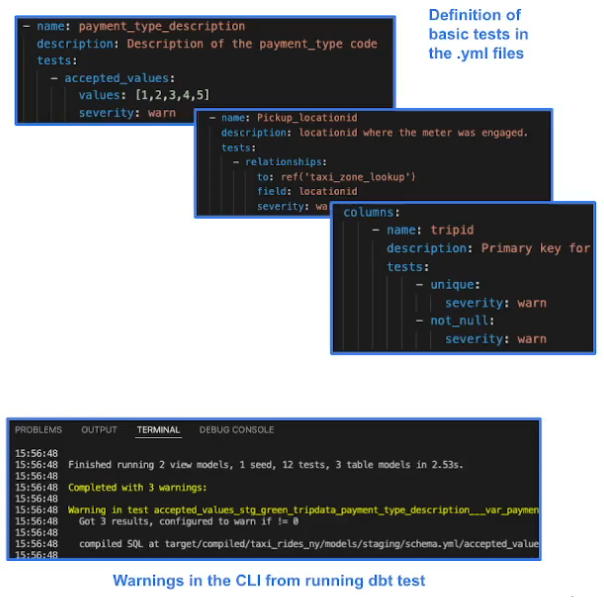
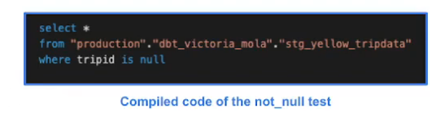

# 4.3.2 - Testing and Documenting the Project

## Tests
- Assumptions that we make about our data
- Tests in dbt are essentially a `select` sql query
- These assumptions get compiled to sql that returns the amount of failing records
    - Aka how many records do not follow the assumption of our data
    - If so, return them
- Tests are defined on a column in the .yml file
- dbt provides basic tests to check if the column values are:
    - Unique
    - Not null
    - Accepted values
    - A foreign key to another table
- You can create your custom tests as queries

- Like macros, if you can create a query for an assumption you can make a custom test
- Can also use premade tests from packages - like from dbt_utils

## Documentation
- dbt provides a way to generate documentation for your dbt project and render it as a website
- The documentation for your project includes:
    - Information about your project:
        - Model code (both from the .sql file and compiled)
        - Model dependencies
        - Sources
        - Auto generated DAG from the ref and source macros
        - Descriptions (from .yml file) and tests
    - Information about your data warehouse (information_schema):
        - Column names and data types
        - Table stats like size and rows
- dbt docs can also be hosted in cloud
- Can be made in CLI with `dbt docs generate` and `dbt docs serve` to generate and serve webpage

## Making Tests
Copy the file `models/core/dm_monthly_zone_revenue.sql` from this repo to the dbt project.
- Make sure to adjust the commented `date_trunc()` for local or BQ

Go back to the schema.yml in `models/staging/`
- Recall the only mandatory entries are the sources we use so dbt can resolve the paths
- Can also add another sections for our models
    - Not mandatory but encouraged
    - Copy in from finished repo (here)
- Can use '>' to write a whole paragraph instead of a line
- Uses the documentation for the columns from the NYC TLC site
- Defines tests for unique and not_null for the 'tripid' column
    - Severity: warn - so it does not stop
    - Can put "error" to fail instead
    - Another test is for Pickup_location_id/Dropoff_location_id using the relationship test
        - Checks if these exist in taxi_zone_lookup in the field_location_id
    - Last test is the 'accepted_values' under 'Payment_type'
        - The values to check against are global variables
        - Also sets 'quote' to false as we take these values as char
- These tests are for both green and yellow tripdata

Go back to dbt_project.yml
- Where we defined seeds, add another section for variables
- Set the accepted values for 'payment_type_values' as [1,2,3,4,5,6]
    - When compiled, these will render as VARCHAR
    - Since we know we want INT, we make this so it is accepted as is

Can run `dbt test` or `dbt test -m <model>` or `dbt build` which runs everything including tests.
- Do `dbt test`
- Can see how it names tests: concatenates name of test, name of model and name of the field
- All but 1 passes - unique trip_id for yellow
    - We have been defining the trip_id as they key but it was not actually unique
    - This is why testing is important

Go back to the tripdata models and the code for deduplication at the top for both models.
- Replace the FROM and WHERE clause

When you test, you either have to go back to your models and modify them because your assumption was true but the model was not true, like we are doing here with the deduplication.
- OR you modify your test because the assumption was not correct.

Run `dbt build`. Everything should pass.
- The logs goes more or less in the order of DAG
- Things that can run in parallel will; e.g. the two tripdata models and the taxi_zone model

Can create schema.yml entries to document `models/core`, `seeds/`, and `macros/`.