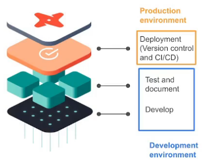
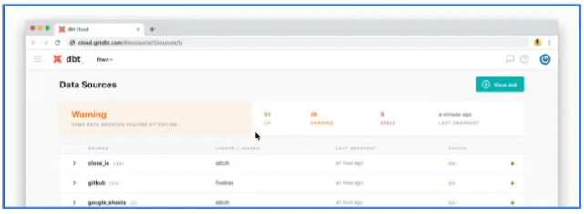
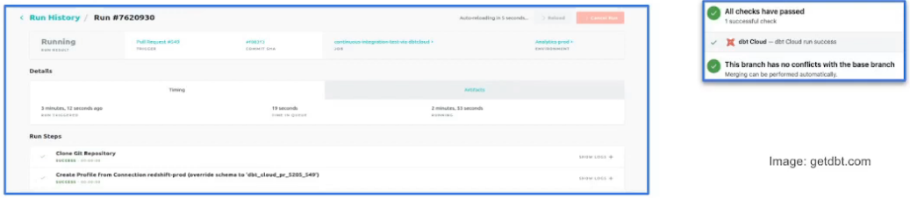

# 4.4.1 - Deployment Using dbt Cloud (Alternative A)

## What is deployment?
- Process of running the models we created in our dev env in our prod env
- Development and later deployment allows us to continue building models and testing them without affecting our prod env
- A deployment environment will normally have a different schema in our data warehouse and ideally a different user
- A development-deployment workflow will be something like:
    - Develop in a user branch
    - Open a PR to merge into the main branch
    - Merge the branch to the main branch
    - Run the new models in the production environment using the main branch
    - Schedule the models

## Running a dbt project in production
- dbt cloud includes a scheduler where to create jobs to run in production
- A single job can run multiple commands
    - Were only running 1 at a time in the IDE
- Jobs can be triggered manually or on schedule
- Each job will keep a log of the runs over time
- Each run will have the logs for each command
- A job could also generate documentation, that could be viewed under the run information
- If dbt source freshness was run, the results can also be viewed at the end of a job
    

## What is Continuous Integration (CI)?
- CI the practice of regularly merging dev branches into a central repository, after which automated builds and tests are run
- Goal is to reduce adding bugs to the production code and maintain a more stable project
- dbt allows us to enable CI on pull requests
- Enabled via webhooks from GitHub or GitLab
- When a PR is ready to be merged, a webhook is received in dbt Cloud that will enqueue a new run of the specified job
- The run of the CI will be against a temporary schema
- No PR will be able to be merged unless the run has been compelted successfully

## Back to Cloud IDE
Commit and merge PR back into main
- Notice that in the Cloud IDE, main is a protected branch
- So, to do development we have to make a new branch, do the work, then open a PR.
    - Can do all of this in dbt cloud

Create a new environment in dbt cloud called 'Production'.
- Set the type to Deployment
- Use latest dbt version
- Don't use a custom branch - defaults to main
- What dataset to use: this is where it writes in BigQuery. Enter 'production'.
- Finish

Open the environment to create a New Job.
- Name it 'dbt build'
- Use Production environment
- Use the version from Production
- Use the default thread and target name
- Click checkbox to Generate Docs
- Can click checkbox to run source freshness - we did not do this though
- Can add any commands we want:
    - `dbt seed`
    - `dbt run`
    - `dbt test`
- Can schedule it:
    - Can use Cron schedule, specific day of the week, or everyday
    - Set it to everyday, every 6 hours
- Under webhooks, we can set to run on PRs
- Save this 

Run the new job.
- Look at the details. We can see all the steps
    - Clones from repo, creates connection to BQ, invoked `dbt deps`
    - Ran the commands we set, made the docs
- Under model timing, we can see models specifically
- Under Artifacts, we can see the compiled, and the manifests with the documentation
- Can go to View Documentation from here - this is the webpage that was generated
    - Look at the models and we can see metadata, description, documentation for every column
        - Can see the dependencies and objects that reference this (nodes and macros)
        - Can see the source and compiled code
    - If we look at the fact_trips model, under the compiled code we can see that it write to Production in BQ
    - In the bottom right, can see the lineage graph summarized
        - In fullscreen we can see the entire DAG
        - Can also use the same syntax from CLI here

Under Project settings > 'taxi_rides_ny' we can also:
- Link documentation from the Prod env
- Can also set source freshness
- Save and close

Refresh, there should now be documentation on the left-side navigation bar.
- Same thing would happen with source freshness if we added it as well

Going back to the Home screen, we can see all of the runs.
- Over time, if we were to make more jobs we would see the history here
- Can also make more environments using the same production credentials and group the runs by env