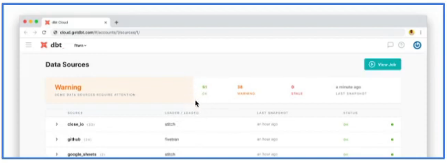
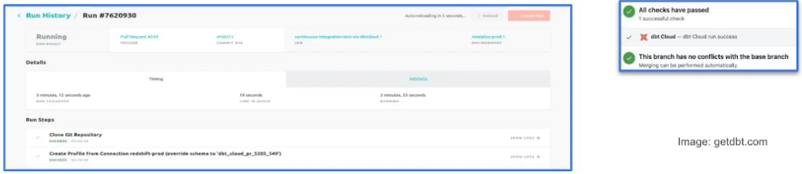

# DE Zoomcamp 4.4.2 - Deployment Using dbt Locally (Alternative B)

## What is deployment?
- Process of running the models we created in our dev env in our prod env
- Development and later deployment allows us to continue building models and testing them without affecting our prod env
- A deployment environment will normally have a different schema in our data warehouse and ideally a different user
- A development-deployment workflow will be something like:
    - Develop in a user branch
    - Open a PR to merge into the main branch
    - Merge the branch to the main branch
    - Run the new models in the production environment using the main branch
    - Schedule the models

## Running a dbt project in production
- dbt cloud includes a scheduler where to create jobs to run in production
- A single job can run multiple commands
    - Were only running 1 at a time in the IDE
- Jobs can be triggered manually or on schedule
- Each job will keep a log of the runs over time
- Each run will have the logs for each command
- A job could also generate documentation, that could be viewed under the run information
- If dbt source freshness was run, the results can also be viewed at the end of a job
    

## What is Continuous Integration (CI)?
- CI the practice of regularly merging dev branches into a central repository, after which automated builds and tests are run
- Goal is to reduce adding bugs to the production code and maintain a more stable project
- dbt allows us to enable CI on pull requests
- Enabled via webhooks from GitHub or GitLab
- When a PR is ready to be merged, a webhook is received in dbt Cloud that will enqueue a new run of the specified job
- The run of the CI will be against a temporary schema
- No PR will be able to be merged unless the run has been compelted successfully

## Back to Local IDE

Go to `~/.dbt/profiles.yml`, recall we create a Postgres profile for the development environment.
- Creating a second output entry, called 'prod'.
    - Will be using the schema 'master'. Can also use a different dbname.
- This allows us to run dbt against a target we've indicated in the CLI
- `target: dev` is set at the top though, so this is the default
- `dbt build` will to the dev env

To run against prod, run `dbt build -t prod`.
- Now we can run against production, you would check out the main branch and run dbt build against prod there

Can also schedule these commands with cron, indicating the command including the target.