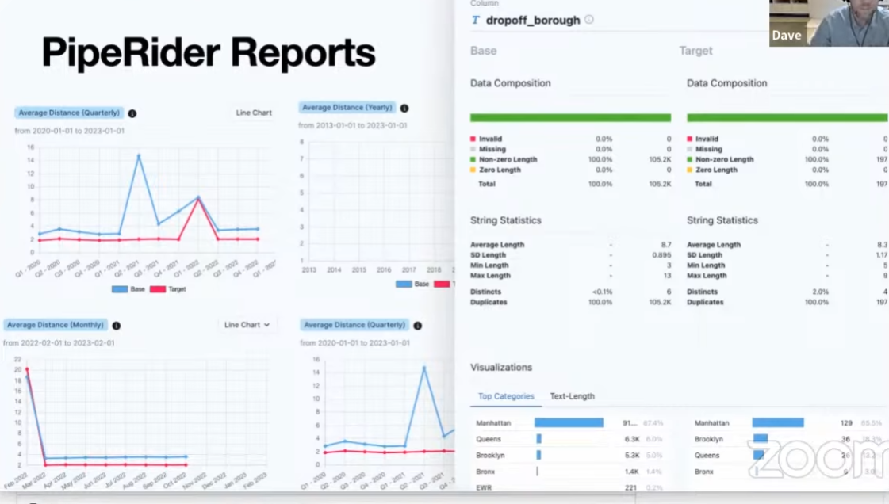

# Maximizing Confidence in Your Data Model Changes with dbt and PipeRider - Dave Flynn

See [piperider.md](../../cohorts/2023/workshops/piperider.md)
- Using the same data from Week 4 homework.

Improving code review for data projects with [Pipe Rider](https://github.com/infuseai/piperider/)
- E.g. PR saying we added statistics model and updated revenue model.
    - Not transparent, no idea how it would run in production.
    - Better PR comment: schema change and differences in business metrics highlighted
        - Shows table summarizing showing if things added or removed
        - Automatic breakdown of differences between dev branch and prod branch
    - More confidence pushing this code into production with this transparance
- In-depth HTML reports about data: schema structure, data composition, data statistics
    - Comparison reports 
    - 
    - Summary for PR pulled from these reports
    - Also business metric supports pulling from dbt

## What's the problem?
Why do we need a better PR process?
- Large and **complex** dbt projects
    - Dozens, hundreds of models
- Large-scale datasets are difficult to understand
    - Hard to get holistic view of data just from making queries

When making data model changes:
- Difficult to assess impact
- Errors make into production

## Current methods
How do you check the data?
- **Eyeballing the data** - or random 'random queries'
    - Does it "look okay"
    - Not reliable at all
- **BI tools** - not ideal, data should be ready by the time it reaches BI tools.
    - No easy way to compare development and production data.
    - Need to be able to prepare data between branches easily
- **dbt tests** - powerful, but you need to write the tests
    - Signal to noise issue with many tests
    - If it fails you need to dig into data and see why anyway

## PipeRider
" [data]Pipe[line]Rider
- Open-source data profiling toolkit
- Improved 'code review for data projects' in dbt
- Automating process in CI

Open-source CLI tool
- Data profiler
- Data profile reports (HTML)
- Data profile comparison
- Multiple data connectors available
- Integration with dbt
    - New focus on this
- Data assertions
    - Like testing but out of the scope of this workshop

PipeRider Cloud (BETA)
- Upload and vew reports
- Compare reports online
    - Not so convenient to share without cloud
    - Automatically upload via key in CLI
- Free to try out: https://cloud.piperider.io

## Data Profiler
Swiss-army knife for data
- Data exploration - understand data
    - Automatic overview
- Data quality analysis
    - Missing values, length of values
    - Statis about data
- Discover hidden data (outliers, weird values)
- Suitable for large datasets
- Easy to digest and share a profile report (without needing to first build dashboard)
    - Great way to share with a team quickly

## PipeRider + dbt
- Automagically detects connection settings for dbt projects
    - Do NOT need to use dbt for this tool
- Available connectors/supported data sources:
    - Big Query
    - DuckDB
    - Postgres
    - Redshift
    - Snowflake
    - SQLite (default)
    - CSV/Parquet

## Using PipeRider
Use cases
- **Developing** and testing data models locally
    - Engineers creating and modifying data models locally
    - Periodically reviewing the data, reviewing the profile
    - Sharing the reports and pushing it to project repo
- **Deploying** model changes
    - Reviewing changes submitted by **pull request** to existing projects
        - Automatically comparing dev branch with prod branch
    - Taps into the version collected nature of dbt projects
        - As they are more like software projects now
    - Automated as part of CI process 

Basic workflow

- Build with models with dbt, then profile with PipeRider
    - Continue to model, profiling as you go
- Then compare reports with PipeRider Compare
- Generate comparison report and use that to improve PR process by adding comparison summary

Basic (local) workflow
1. Create a branch
2. Install Piperider
3. Initialize PipeRider
4. dbt build
6. Run PipeRider (initial report)
7. dbt build
8. Run PipeRider (second report)
9. Compare reports
10. Pull request with comparison summary

## Prerequisites
- Do Week 4 project 
    - Using dbt-core
    - NYC TLC data in Data Warehouse/local DB
- Fork and clone project repo: https://github.com/InfuseAI/taxi_rides_ny_duckdb
    - Apparently very useful and fast

### PipeRider DuckDB Repo

dbt Core:
- installed: 1.4.1

dbt Plugins:
- duckdb: 1.4.0

Python: 3.9.10 (3.8 also tested)
DuckDB: 0.7.0 f7827396d7

- Start following instructions in repo README