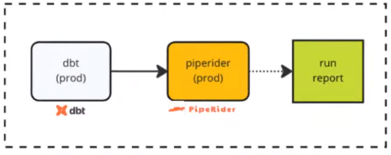
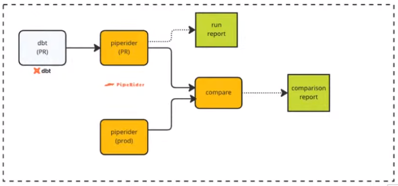

# PipeRider Workshop

## Prerequisites
- Do Week 4 project 
    - Using dbt-core
    - NYC TLC data in Data Warehouse/local DB
- Fork and clone project repo: https://github.com/InfuseAI/taxi_rides_ny_duckdb
    - Apparently very useful and fast

### PipeRider DuckDB Repo

dbt Core:
- installed: 1.4.1

dbt Plugins:
- duckdb: 1.4.0

Python: 3.9.10 (3.8 also tested)
DuckDB: 0.7.0 f7827396d7

- Start following instructions in repo README

## Workshop

Same as week 4 with minimal changes, e.g. removing `limit 100` on dbt models.

Once everything is installed, switch branch as you would in real-world setting.
- `git switch -c data-modeling`
- Install dbt deps and build dbt models
    ```
    dbt deps
    dbt build
    ```
    - Ignore warning
    - Had to update duckdb to 0.7.0 for compatibility here
- Initialize PipeRider: `piperider init` (creates PipeRider directory)
    - Automatically gets the data for piperider config from dbt_project.yml
    - Also makes compare recipe to control how PipeRider compares different environments
- PipeRider is unintrusive (just in `.piperider/`)
    - Does not change anything. Can't delete PipeRider and be done
- Edit PipeRider config `vi .piperider/config.yml`
    - Enable profiler.table.duplicateRows
- Check PipeRider settings: `piperider diagnose`

## Step 2
- Run PipeRider: `piperider run`
    - Ignore warning.
    - PipeRider has connected to our datasource (dev)
    - Has profile 3 tables (fact_trips, dim_zones, dm_monthly_zone_review)
    - If you had dbt tests they would be shown here (we won't do this here)
        - Would also run tests and show results
    - Get two things out of PipeRider:
        1. Raw profiling report `.piperider/outputs/latest/run.json`
        2. HTML profiling report: `.piperider/outputs/latest/index.html`
    - Open the HTML report in web browser
        - Shows all of our tables, can drill down and see more info
            - See number of rows, columns, records, schema
        - Can see field stats, missing values, get an overview etc
- Back to the code, open the dm_monthly_zone_revenue model
    - Comment out the 'Additional calculations'
- Continue following README and create `models/core/dm_monthly_zone_statistics.sql`
- Run `dbt build` again
- Run piperider again to see the changes and second data report
- Run `piperider compare-reports` to see the comparison of the changes
    - Shows both versions of the report
    - Don't do anything
- Automatically run last two reports `piperider compare-reports --last`
    - Get comparison report and comparison summary
        - Open report in web browser
            - Shows before and after for rows and columns
            - `dm_monthly_zone_statistics`: If there's no 'before' then the table did not exist previously
                - Can see this is a new table with new columns and new rows
            - `dm_monthly_zone_revenue`: Can see the rows that were commented out are gone
        - Open preview of summary, just a markdown file
            - GitHub compatible markdown file - would copy this into Pull Request
            - Would see differences in the valid and distinct for each table
                - We only added a table and removed some columns though
- Add the files to git, and commit
- Go to the Github repo, switch to the branch data-modeling, and make a PR
    - Go back to the summary and copy it entirely as a PR comment
    - This is a simulated PR process, imagine someone reviewing what you are doing, in a better position to actually accept the PR.

## Step 3
Go back to the repo, see README step 3.
- We used `compare-reports`, but there is another command `compare`, a powerful command that compares the 'recipes'
    - These define:
        - Branches to compare
        - Datasource/target to compare
        - The dbt commands to run prior to compare
    - PipeRider is initialized with a default compare recipe 
- As per the recipe, PipeRider will automatically do the following:
    1. Check out the main branch
    2. Build the models
    3. Run PipeRider
    4. Check out the data-modeling branch
    5. Build the models
    6. Run PipeRider
    7. Compare the data reports of main and data-modeling
    8. Output the compare report and summary
- `piperider compare` should automatically switch to the main branch, run dbt build, run piperider
    - Switches back, build again and run piperider again
    - Then runs compare automatically, and outputs the comparison summary and comparison report
- We did not use this command immediately because it is important to know the process
    - A pro would just be running this command

## Step 4
Also supports `dbt metrics`, a fairly new feature.
- dbt calls it an aggregation over a table that supports zero or more dimensions
- A way to define time-series business metrics inside of dbt
- Not a lot of widespread use seen yet but it is a powerful command
- We will add this to the project

Metrics are defined inside the schema files.
- Go to `models/core/schema.yml` and copy the code in from the README
    - Important thing to notice is that we add this tag 'piperider' at the bottom
    - Need it to have the metrics appear in the report
    - Defines a new metric based on the 'fact_trips' table and calculate the average trip_distance with the time_grains [month, quarter, year]
- Save the file and then run `dbt compile`
    - Running `piperider run` and it will have automatically detected the metrics
    - Look at the new report in the web browser and you will see the metrics we just defined
- Say you want to filter the metric, e.g. apply filters on borough to our metric
    - Copy in the yaml from the README to `models/core/schema.yml`
- Save the file and run `dbt compile` and `piperider run`
    - Run `piperider compare-reports --last`
    - Look at the report > Metrics
- Say you made a change to a critical model and want to see the difference, you can see that here.
    - A unique feature here is that PipeRider has this in the comparison summary
    - Add it as a comment to the PR and look at the metrics summary

## Continuous Integration
Why CI with data projects?
- Automate tasks on a software projecct
    - Building, testing, linting
- Ensures quality (no more merging buggy code)
- Data projects are now full 'software projects'
    - E.g. a dbt project
- Data projects should take advantage of the automation CI brings

CI documentation from PipeRider docs: https://docs.piperider.io/ci/introduction/

Medium article: "High-performing data teams should not try to 'increase data quality', they should try to increase the speed and the quality of their work - at the same time." - Sven Balnojan
- Same metrics that software teams should focus on

Should be using CI to:
1. Test your incoming data regularly (production env)
    - Periodic data transformation and profiling
    - 
    - Say you have an ingestion everyday, you could schedule a production run of piperider
        - Profile the data and upload the report somewhere the team can keep an eye on.
2. Test your changes before deploying (pre-commit checks)
    - A/B deployments: production and PR schema
    - Preview new models/changes (PipeRider report for validation)
    - 
    - Similar to before, automatically comparing development and prod and attaching the summary to the PR comment
        - And attaching comparison to the CI run as an artifact
    
## CI Example
Cannot follow these steps but he shows us. Just a demo. Opens the week 4 project with Github actions defined:
- Defines variables pulled from the repository
- 3 different targets: dev target, pr target and prod target
    - dev is self-explanatory
    - GitHub actions uses the pr schema on commit to build and compare the models to the production ones
        - Looks essentially like the CI steps
    - Prod is self-explanatory
- Github actions recap: can define steps and jobs in github actions to automatically peform CI actions
    - We are setting up environment, checking out PR branch, installing dbt and PipeRider
    - Builds the PR env, PR env profile, switchs to the main branch, building and profiling that
    - Compares the two data reports, automatically putting the compare summary into PR comment
    - Then uploading the compare-report as an artifact to the run inside Github
- These Github actions are quite complicated, is simpler with Snowflake
    - Worth the effort though

In CLI switches to another branch 'zoomcamp'
- Runs `dbt deps` and `dbt build`. Might take some more time on BigQuery rather than DuckDB
- Remakes the statistics model and comments out the same 3 lines we did at the start
- Would know what we are doing, so we will let Github CI handle
    - Commits the changes and pushes the branch up to the origin.
- Creates PR with the commit and Github actions will be triggered
    - Goes to the details, can see the environment being set up.
    - Will build in the current and prod branches, profile them and then compare them

To push a report to the cloud
- Run `piperider cloud login`, and it asks to paste in the API token
- Asks if you want to auto-upload reports.
