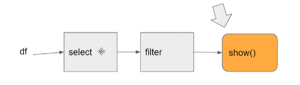

# 5.3.2 - Spark DataFrames

Recap:
- Took first look at PySpark, how to read CSV file
- Learned about Partitions
- Saved file to parquet
- Learned about Spark Master UI

Learning more about DataFrames now
- Using the same notebook, read the parquet with `spark.read.parquet('fhvhv/2021/01/')`
    - Because we loaded it last time before saving, Spark knows the schema now (df.printSchema())
    - This type knowledge lends itself to why Parquet is a smaller file type, can compress itself smaller
- Select the datetime and location ID columns and filter by the first field
    - This is a lazy command also, will not run until we need it
- Run `.show()` on the same command.

In Spark there is a distinction between things executed right away and things not executed right away
- **Transforms** - lazy (not executed right away)
    - Examples: 
        - Selecting columns
        - Filtering
        - Transformations on columns
        - Joins
        - Group by
    - In the background, Spark creates a sequence of transformations e.g. select, then filter, etc
    - The moment we run `.show()`, this sequence is executed.
    - 
- **Actions** - eager (executed immediately)
    - Examples:
        - Show, take, head
        - Write
    - Triggers execute sequences
- Spark compresses these Transforms into one jobs
- Alexey prefers to run these Transforms in SQL
- Recommends looking at the Spark documentation to see how to do more complex operations like group by

So, why use Spark if these commands can be done in SQL?
- Because of User Defined Functions (udf)
- Import: `from pyspark.sql import functions as F`
- Use the `F.to_date()` function to take the columns convert the datetime fields to just date
    - Now in the same command run the select command from earlier
- We can use the pyspark functions import to make our own UDFs
    - Inconvenient to define our own function in DWHs
    - PySpark is the ideal way to do this as you can put it in your git repo, run tests etc.

Say we have a function that is doing something crazy, not super easy to express with SQL.
- E.g. `def crazy_stuff()`, it is operating on 'dispatching_base_num',
    - If the number is divisible by 7, do one thing. Otherwise, do another
- PySpark is the best way to implement something like this as it is easily testable here
- Convert function to UDF with `crazy_stuff_udf = F.udf(crazy_stuff, returnTypes=types.StringType())`
- Copy the pipeline we made and add the UDF after the first two `.withColumn()`

PySpark allows you to have the best of both worlds.
- Run easy, elegant, fast SQL first in Spark pipeline
- Then call Python job for the crazier jobs needed by Machine Learning.