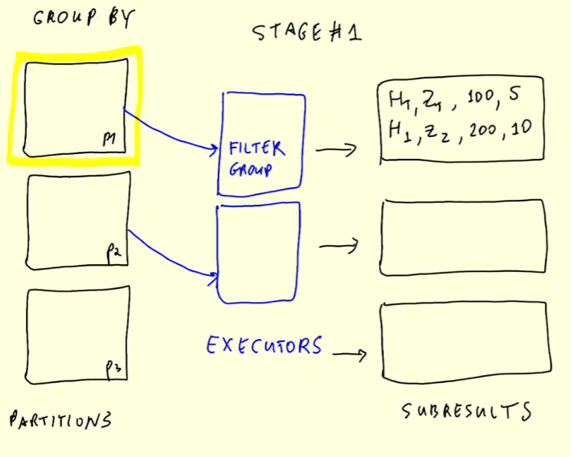
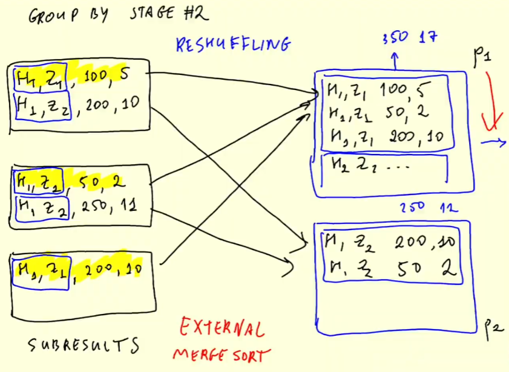

# 5.4.2 - GroupBy in Spark

Recall we were working with SQL in Spark [06_spark_sql.ipynb](../code/06_spark_sql.ipynb)
- We will now look at how these work internally in Spark

Create new notebook '07_groupby_join.ipynb'
- Load green dataset, load as a Spark table, apply the following SQL:
    ```
    SELECT 
        date_trunc('hour', lpep_pickup_datetime) AS hour, 
        PULocationID AS zone,

        SUM(total_amount) AS amount,
        COUNT(1) as number_records
    FROM
        green
    GROUP BY
        1, 2
    ORDER BY
        1, 2
    ```
- Keeps showing records from before 2020, so we add filter.
- Write results `df_green_revenue.write.parquet('data/report/revenue/green')`
    - Works really fast (2s)
    - 3 stages
        1. Prepares for GROUP BY
        2. Does GROUP BY
        3. Does ORDER BY
    - Remove ORDER BY and overwrite to see that the third stages disappears

## Spark Under the Hood
Say we execute that query again, with 3 partitions and 2 executors.

Stage 1 (first GROUP BY)
- 
- Each executor pulls a partition
    - First executor does the filtering, and then the inital GROUP BY
        - Why intial? Because each executor can only process 1 partition at a time
    - Then second executor processes partition 2
    - Then the first one done process partition 3
- Each executor outputs the hours, zone, amount, and records
    - Sorted by the GROUP BY step
    - Will have 3 results (for each partition)
- When done, each partition has an output - the temporary results, or subresults

Stage 2 (second GROUP BY)
- 
- Say we have some subresults from the first stage. Need to take all these records and combine them into one
- Process to do this is called **reshuffling**. Shuffles the records around between different partition
    - The first part (hour, zone) of the records is the key, and every record with the same key must end up in the same partition.
- The algorithm used for sorting here is called **External Merge Sort**
- Say this algorithm outputted two partitions
    - Gets the overall outputs (count, sum etc) of each key
    - End up only one combined result for each key

We saw these two stages in the DAG:
- 

## Back to Notebook
Apply same SQL to yellow dataset and write.
- May take some time to write. Look at the DAG
    - Same process as earlier. Should be as many tasks as partitions
    - Can repartition during write step so we have less (too small to be useful right now)

Now, if we take a look at the jobs, we should see 3 stages:
1. First GROUP BY
2. Aggregation and calculating (and shuffling)
3. Repartitioning (and shuffling)

Can see the job needed to shuffle about 12.2 MiB (of 6.1 MiB input)
- Take a look at the report folder (`tree data/report/`)
- Can run `ls -lhR data/report/` to see the file sizes
    - Alexey had about 15MB for yellow, but I had over 800MB
- Not a big dataset, so this is probably better (for green) than having 200 partitions

## Recap
How GROUP BY is implemented
- In summary, happens in two stages
    - First stage does GROUP BY within each partition
    - Second stage does some reshuffling to have the same keys together, then reducing these records with the same key
- Then return final result.