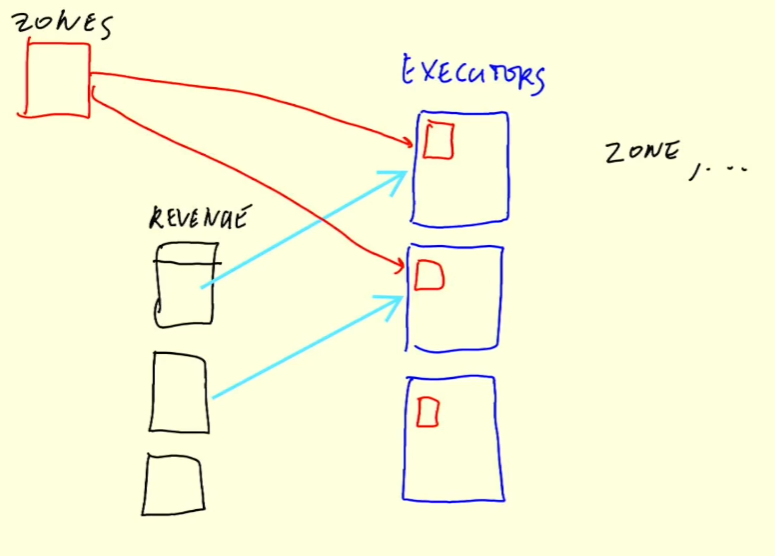

# 5.4.3 - Joins in Spark

Recap
- Talked about Spark cluster, under the hood
- Also talked about GROUP BY is implemented
- Reshuffling

## Joins
- Joining two large tables
- Merge sort join
- Joining one large and one small table
- Broadcasting

## Joining Two Large Tables
Recall we made the two tables for the yellow and green tables
- Did GROUP BY hour and zone
- Both have hour, zone, revenue, and number of trip fields
- Want to join these two to be wider table with 6 columns
    - hour, zone, revenue_yellow, number_of_trips_yellow, revenue_green, number_of_trips_green
- Want these to be joined on hour and zone

Go back to [07_groupby_join.ipynb](../code/07_groupby_join.ipynb)
- Outer join green and yellow revenue datasets and save to new df, `df_join`
    - Recall outer join returns every row and sets values to `null` on rows with no overlap
- Apply `df_join.show()`
    - Can confirm there are null values in pairs of 'amount' and 'number_records'
    - However, we cannot confirm which column is which (for green or yellow). Have to fix this
- Rename the green and yellow columns mentioned to begin with "green_" or "yellow_ respectively  
- Columns should be more informative now.
- Save as 'data/report/revenue/total'

In the meantime, look at the Job in the Spark UI.
- First stage, where were reading data and doing GROUP BY for the first taxi type
- Second stage, same but for the other taxi type
- Third stage, combines these two dataframes into one.

## Merge Sort Join
Under the hood:
- We have e.g. 2 partitions for yellow and 2 partitions for green; want to join these.
- Each record $i$ is $(y_i = (H, Z, R, C))$, somewhat complex.
    - Creates a complex record with two columns $((K_i, Y_i))$
        - $K_i$ is a key made of $H_i$ and $Z_i$
    - Done for every record, and partitioned accordingly.
    - Same thing happens with green but $((K_i, G_i)) and so on
- Now we need to shuffle. Like how we reshuffled for [GROUP BY](./5.4.2-groupby-in-spark.md#spark-under-the-hood)
    - Purpose of this is to make sure that, for example, we have a $K_1$ for yellow that goes to the first partition but not green
        - Otherwise all $K_2$ will go to the second partition and so on 
    - Want records with the same key to end up in the same partition.
- Then the keys are paired within each parition
    - In the cases we don't have a pair (e.g. yellow $K_1$ but not green $K_1$)
        - Will return e.g. $K_1$, $Y_1$, ∅ or $K_1$, ∅, $G_1$
    - Successful pairs will return e.g. $K_2$, $Y_2$, $G_2$
- We can see the join is implemented as SortMergeJoin in the Spark Job DAG

Note that we have been reperforming the computation each time rather than loading the transformed report, before joining the dataframes.
- Add read lines before the column renaming lines (e.g. `df_green_revenue = spark.read_parquet('data/report/revenue/green/')`)
- After running and saving the report, does not seem to make much difference time wise
    - Perhaps the dataframes are not large enough
    - Or, because we are joining and grouping by the same field, the plan looks the same as when running these on-the-fly

## Large Table and Small Table
Load the `df_join` dataframe from the saved report
- Say we want to see what these zones actually are, using another file containing the zone data (['taxi+_zone_lookup.csv'](../notebooks/taxi+_zone_lookup.csv) converted to [zones/](../notebooks/zones/))
- Now we want to join `df_join` with `df_zones` on df_join.zone == df_zones.LocationID
- Now shown while dropping LocationID and zone (redundant): `df_result.drop('LocationID', 'zone').show()`
    - Save to 'tmp/revenue_zones' instead
- Look at the job we can see there was only one stage: scans parquet and applies in WholeStageCodeGen

## Broadcasting

Also performed BroadcastExchange
- This is because `df_zones` is a very small table.
- Given one table is very small and the other is large:
    - Each executor gets a partition of 'revenue' (`df_join`), and instead of doing External Merge Sort, each executor gets a copy of `df_zones`
    - `df_zones` is small enough for each to get a copy
- For each record in revenue, we have this zone id, and we just look up this information in `df_zones`, and do this for every record
- No need to shuffle, just sends small table to every executor. Much faster than Merge Sort.