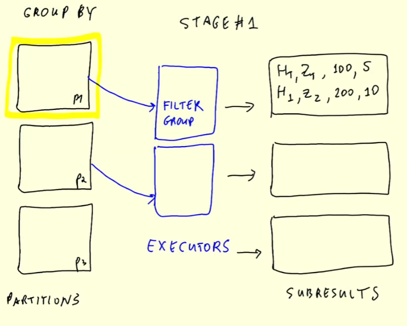
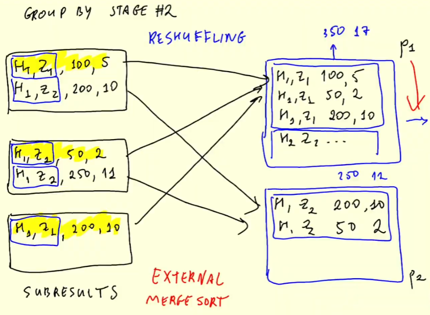
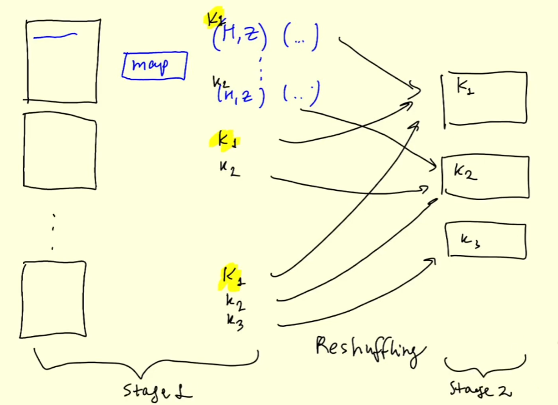

# 5.5.1 - (Optional) Operations on Spark RDDs

Lower level operations on RDDs, what DataFrames are abstracted from.
- What Spark originally used before using DataFrames in second version

Don't usually need to use RDDs, so this is *optional.*
- Will see how things used to be done or how it is done internally

## Overview
5.5.1 - RDDs: map and reduce
- What is an RDD and how is it related to DataFrames
- From DataFrame to RDD
- Operations on RDDs: map, filter, reduceByKey
- From RDD to DataFrame

5.5.2 - Spark RDD mapPartition
- mapPartitions are still useful

## Spark RDDs
- Say we partitions $p_1, p_2, ..., p_50$
- This is distributed among 3 executors, taking a partition and executing on them
- These the DataFrame partitions but they actually handled on RDDs
- Data Frames: have schema
    - RDD: collection of objects

## From DataFrame to RDD
See directly: create notebook `08_rdds.ipynb`
- Want to implement the SQL from the [07_groupby_join.ipynb](../notebooks/07_groupby_join.ipynb) for RDDs directly
- Check `df_green.show()`. There is a field called `rdd`, which is the underlying RDD of the DataFrame
    - Run `df_green.rdd.take(5)` to see what these all are
    - Can run `df_green.take(5)` to see how directly DataFrames are built on RDD *Rows*
- *Rows* are special objects that are used for building DataFrames
- Can do anything with these RDDs. Will see basic operations first

## Operations on RDDs
We have quite a bunch of columns in each row. Want to only take the ones we need.
- Converting the SQL select statements (besides count) into DataFrame operations
- We only want the rows from dates starting from 2020, so we can use **`rd.filter()`**
- Note that when you run `rdd.filter(lambda row: False).take(1)`, we can filter by rows

Import python datetime
- Create `start` object: `start = datetime(year=2020, month=1, day=1)`
    - Define function to return only rows where the datetime is greater than or equal to start
- Apply this instead of the lambda to `rdd`
    - Lambdas can get messy quite fast

Now we want to implement the SELECT and GROUP BY
- Recall the following image:
    - 
    - We apply GROUP BY to each partition and get a subresult for each partition as on the right
    - E.g. $(H_1, Z_1)$ are the key and 100, 5 are the values
    - Now need to do something similar to have a lot of intermediate results that will reduce to something like:
    - 
- Apply `.map()` function to the `rdd.filter()` statement
    - `.map()` function takes in a *Row*, transforms, and outputs
    - RDD in, RDD out
- Output needs to look like: Key is $(H_1, Z_1)$, value is (AMT, CNT)
    - Each value will be (amt, 1) and we will sum all these 1s later when we do grouping

Make function `prepare_for_grouping(row)`
- Need to truncate datetime object in each row to just hour
- Need row
- Make key from (hour, zone)
- Make value from amount (total_amount) and count (1), so value = (amount, count)

### Reduce By Key
Given an RDD:
- Take the value, and output the key and some reduced value
- The input RDD will have a lot of elements with the same key but, return only one element per key
- Eg. many records like: [$((key_1, ...))$, $((key_1, ...))$, $((key_2, ...))$, $((key_2, ...))$, ...]
    - Returns $((key_1, ...))$, $((key_2, ...))$ ... for each $key_i$

How reduce works:
- Given $((K_1, V_1))$, $((K_1, V_2))$, $((K_1, V_3))$
    - Takes a pair at a time. $V_1, V_2$ => $V_1 + V_2$ => $V_2$\*
    - $V_2 *, V_3$ => $V_2 * + V_3$ => $V_3$\*
- Define function `calculate_revenue(left, right)`
    - Take the amount and count from each value (left and right)
    - Sum the amounts and counts
    - Return final (amount, count)
- Add this to the rdd transformation as `.reduceByKey(calculate_revenue)`
- Looking the rdd, see the second tuple:
    - First is composite amount
        - E.g. 79.5 fare for a given hour and zone
    - Second is composite count
        - E.g. 3 rides in a given hour and zone

## RDDs to DataFrames
On the same rdd line:
- Need to add new function, `unwrap()` which returns each value of the row in order
- Need to add `.toDF()`, and add `.show()` just to see

We lose the schema and column names
- Import `namedtuple` from collections
    - Name the 'hour', 'zone', 'revenue' and 'count'
-  Need to adjust StructTypes:
    - ```
        types.StructType([
            types.StructField('hour', types.TimestampType(), True),
            types.StructField('zone', types.IntegerType(), True),
            types.StructField('revenue', types.DoubleType(), True),
            types.StructField('count', types.IntegerType(), True)
        ])
        ```
    - Converts LongTypes to IntegerTypes
- Define this as `result_schema` and add it to `.toDF()` for the rdd and assign to `df_result`
    - Write this out to `tmp/green-revenue`

Go to Spark Master UI and look at the job DAG


- Two stages, with more tasks than what we saw in pure SQL
- Likely because we used map and mapPartition which are considered different commands
- We have two stages because we have the `.reduceByKey()` command
    - This needs reshuffling, because we have a bunch of partitions
    - Applies `.map()` on each partition, giving us the $K_1$: (H,Z)(...), $K_2$: (H,Z)(...), ... per partition
    - Need to make sure all the same keys in the same partition
        - E.g all $K_1$ records in the $K_1$ partition.
- First stage involves mapping, second stage involves reducing.

## Recap
Just to illustrate how things were done in the past:
- Expressed the earlier SQL with rdd
- Filtered outliers (WHERE statement)
- Prepared for mapping (SELECT)
- Reduce By Key where we do the sum and count (SUM and COUNT)
- Map to unwrapped values to convert back to DataFrame
- Convert to DataFrame object and use the original schema again