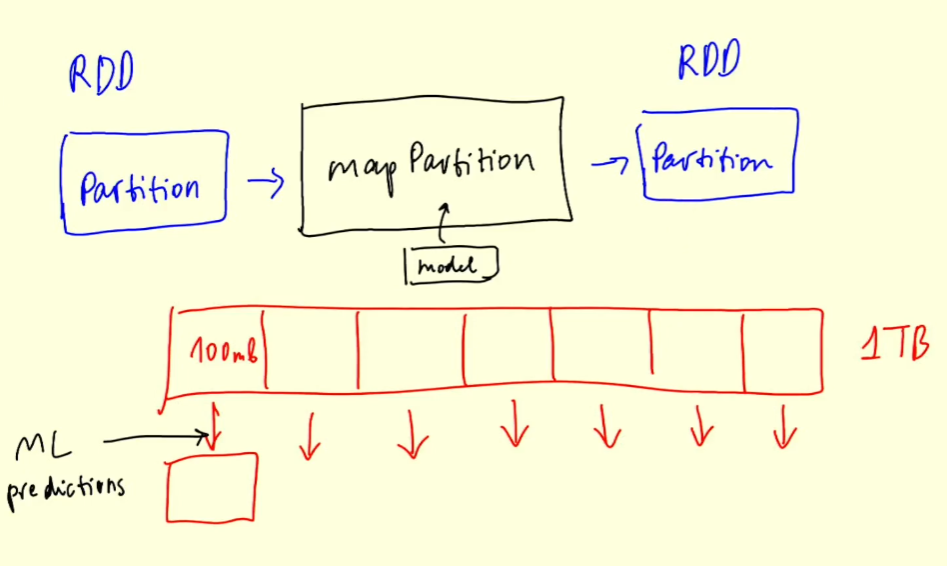

# 5.5.2 - (Optional) Spark RDD mapPartition

## Recap
- Talked about RDDs and how they are related to DataFrames
- Converted GROUP BY SQL from before into RDD operations

## MapPartition

Function similar to map, which takes in each row of an RDD and returns a transformed row
- mapPartition takes an entire partition, applies some function, and outputs some result
    - RDD input, RDD output
- E.g. 1TB of data, and we do not have that much memory
    - Each partition might be 100MB, creating a new, transformed partition for each input
- Convenient for many applications
    - Function of mapReduce could be applying an ML model for predictions
- We just put a model in a mapPartition function, then Spark will chunk a big dataset for us into smaller ones and apply to each partition for us.
    - Can then have these results written to a datalake

Say we want to create a server that predicts the duration of a trip
- Would be a machine learning model
- Need the fields 'VendorID', 'lpep_pickup_datetime', "PULocationID', 'DOLocationID', 'trip_distance')
- Select these fields from `df_green`

## MapPartition on RDDs
Convert df_green to rdd after selecting the columns
- Create function `apply_model_in_batch(rows)` and return [1]
    - Apply via `rdd.mapPartitions()` and turn to list with `.collect()`
    - `.collect()` 'flattens' the list
- Want to count the length of each partition
    - Need to iterate over it (it is an iterator)
    - Count 1 each time
- Can see our partitions are not super balanced, i.e. is over 1m, rest are less than 0.5m
    - Could do repartitioning, but not worth the large cost here
    - Will have to learn this on our own

Now we turn partition into Pandas DataFrame
- Can do this by wrapping `pd.DataFrame(rows, columns = columns)`
    - Put this into the `apply_model_in_batch(rows)` function and replace iteration
- Get the same partition sizes

Puts the whole partition in DataFrame, which is not always good
- Can use pythons `iterator.iterslice()` to break up these iterations into smaller amounts (e.g. 10,000)

Create function `model_predict(df)`
- Create some model before hand and apply model
- Make simple model, for each mile of the trip, multiply by 5
- Need to use this in `apply_model_in_batch()`, ubt we need to use DataFrame itertuples first
    - Iterate over itertuples (each row as tuple)
    - Need to `yield` each row
        - What is `yield`? Say we have a python function `infinite_seq()`
        - Increments `i` in infinite loop, yields `i`, and adds 1 each time.
        - This function will act like an iterator, can do `.next()`, iterate over it, etc
        - Saves the value of `i` between calls
        - If we limit it, we can materialize as finite sequence
    - Do this instead of counting

Apply `apply_model_in_batch()` and apply `.take(10)1
- Can turn back into DF now. Managers to infer column names
- There is some issue with 'lpep_pickup_datetime' when we convert back to DF but not with RDD
- Also want to drop 'Index' field as it is not useful and generated by RDD conversion
- Just select the 'predicted_duration' field. Shows we can apply model in mapPartition

## Real-Time

Ideally would want to do this in real-time, not with Spark.
- Someone would check in phone app, calls ML service via internet, returns info to app.

This was just for the sake of example, but would probably use a web service, not Spark.